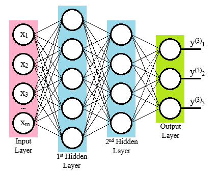

```{r loadlib, include=FALSE}
#mydata <- read.csv('/Users/xbasra/Documents/Data/Clustering/Data/Airway Disease Phenotyping Data Sets4/WSAS And OLIN Airway Disease Phenotyping.csv')
library(dplyr)
library(ggthemes)
library(FactoMineR)
#library(factoextra)
#library(arsenal)
library(plotly)
library(cowplot)
library(tidyverse)
#library(treeClust)
library(Rtsne)
library(ggplot2)
library(reshape2)

library(GGally)
#library(hrbrthemes)
#library(viridis)
```


```{r Data, include=FALSE}
mydata <- read.csv("/home/rstudio/Airway_Clustering//Original_Data/AirwayDiseasePhenotypingDataSets5/WSAS_AndOLIN_AirwayDiseasePhenotyping.csv")
#mydata <- read.csv('/Users/xbasra/Documents/Data/Airway_Clustering/Original_Data/AirwayDiseasePhenotypingDataSets5/WSAS_AndOLIN_AirwayDiseasePhenotyping.csv')
result_airway_uft_DEC <- read.csv('/home/rstudio/Airway_Clustering//Presentation/result_airway_uft_DEC.csv')
#result_airway_uft_DEC <- read.csv('/Users/xbasra/Documents/Data/Airway_Clustering/Intermediate/CSV_output_data/result_airway_uft_DEC.csv')
DEC_Embedding <- read.csv("/home/rstudio/Airway_Clustering//Presentation/DEC_Embedding_airway_df.csv")
umap_auto_embedding_df <- read.csv("/home/rstudio/Airway_Clustering//Presentation/umap_auto_embedding_df.csv")

df_airway <- read.csv("/home/rstudio/Airway_Clustering//Original_Data/AirwayDiseasePhenotypingDataSets5/WSAS_AndOLIN_AirwayDiseasePhenotyping.csv")
```


```{r functions, include=FALSE}
Get_Binary_data <- function(Data){
  # checking the data format
  if (!is.data.frame(Data)){
    stop("The Data is not in dataframe format")
  }
  # droping lopnr
  # Selecting Specific Variables under the selection creteria. other_CVD all yes
  drops <- c("lopnr","kohort","urbanization","rhinitis_ever","wheeze_ever")
  Airway2 <- Data[ , !(names(Data) %in% drops)]
  
  # this is only to adjust the smoking varaible to three categories Basically replacing number 0 with Never-Smoker
  Airway2 <- Airway2 %>% mutate(ever_smoker20py=replace(ever_smoker20py, ever_smoker20py==0, 'Never-smoker')) %>% as.data.frame()
  # replacing ever_Somoker variable with integer values
  Airway2$ever_smoker20py <- ifelse(Airway2$ever_smoker20py == 'Never-smoker',0, ifelse(Airway2$ever_smoker20py == '<=20 packyears',1, ifelse(Airway2$ever_smoker20py == '>20 packyears',2,0)))
  # converting the ever_somke to integer variable
  Airway2$ever_smoker20py <- as.integer(Airway2$ever_smoker20py)
  
  Airway2 <- mutate(Airway2, Longstanding_cough = if_else(Longstanding_cough == "Yes", 1L, 0L),
                    Sputum_production = if_else(Sputum_production == "Yes", 1L,0L),
                    Chronic_productive_cough = if_else(Chronic_productive_cough == "Yes", 1L, 0L),
                    Recurrent_wheeze = if_else(Recurrent_wheeze == "Yes", 1L,0L),
                    exp_dust_work = if_else(exp_dust_work == "Yes",1L,0L),
                    gender = if_else(gender == "male", 1L,0L))
  return(Airway2)
}

## Density plot
dist_plot_clust <-function(original_data, selected_variable, variable_name){
  selected_variable <- enquo(selected_variable)
  ggplot(original_data, aes(UQ(selected_variable))) + geom_density(aes(fill = factor(clusters)), alpha=0.8) +
    labs(#title = "Density plot",
         #subtitle="variable of persons Grouped by Clusters",
         #caption="Source: Source: results of Deep Learning Clustering",
         x= variable_name,
         fill="Clusters")
} 
```


# Autoencoder

## Introduction

- Autoencoders are a specific type of neural networks where the input is the same as the output (unsupervised learning). They compress the input into a lower-dimensional compressed representation (space) and then reconstruct the output from this representation. 


---

- An autoencoder consists of 3 components: encoder, code (latent space) and decoder. 

<!-- The encoder compresses the input and produces the code, the decoder then reconstructs the input only using this code. -->


- To build an autoencoder we need an encoding method, decoding method, and a loss function to compare the output with the target. 

<!-- We will explore these in the next slide -->

<!-- ## -->

<!-- Autoencoders are mainly a dimensionality reduction (or compression) algorithm with a couple of important properties: -->

<!-- - Data-specific: Autoencoders are only able to meaningfully compress data similar to what they have been trained on. Since they learn features specific for the given training data, they are different from a standard data compression algorithm like gzip. So we can’t expect an autoencoder trained on handwritten digits to compress landscape photos. -->

<!-- ## -->

<!-- - Lossy: The output of the autoencoder will not be exactly the same as the input, it will be a close but degraded representation. -->

<!-- - Unsupervised:  Autoencoders are considered an unsupervised learning technique since they don’t need explicit labels to train on. But to be more precise they are self-supervised because they generate their own labels from the training data. -->

# Architecture of the Autoencoder

## 

- Both the encoder and decoder are fully-connected neural networks. Code (the latent space layer) is a single layer of the neural network with the dimensionality of our choice. 

<!-- The number of nodes (neurons) in the code layer is a hyperparameter that we set before training the autoencoder. -->



##


## 

The workflow of the autoencoder. First the input passes through the encoder, to produce the code. 


##

The decoder, which has the similar structure, then produces the output only using the code. 


# mutual information-based unsupervised feature transformation

## Motivation

- Traditional centroid-based clustering algorithms for heterogeneous data with
numerical and non-numerical features result in different levels of inaccurate clustering. 

- This is because the Hamming distance used for dissimilarity measurement of non-numerical
values does not provide optimal distances between different values-

- Another problems arise from attempts to combine the Euclidean distance and Hamming distance. 

##

- Use the mutual information (MI)-based unsupervised feature transformation (UFT), which can transform non-numerical features into numerical features without information loss.
- For the original non-numerical features, UFT can provide numerical values which preserve the structure of the original non-numerical features and have the property of continuous values at the same time.

- For example: the variable ever_smok20py. Number of smoking packs per year with three options (Never smoke, less the 20 packs per year, more than 20 packs per year)

##

{width=100%}

# Deep Embedding Clustering 

##


* Deep clustering is a recent trend in the machine learning community that aims to employ a deep neural network in an unsupervised learning form.  

* One of the main families of deep clustering is Deep Embedding Clustering (DEC)^1^ . The fundamental work of DEC is to learn latent space that preserves properties of the data.

* 1- Xie, Girshick, and Farhadi (2016).

<!-- <style> -->

<!-- .footer { -->
<!--     color: black; background: white; -->
<!--     position: fixed; top: 20%; -->
<!--     text-align:left; width:100%; -->
<!-- } -->

<!-- </style> -->

<!-- <div class="footer" style="margin-top;font-size:60%;"> -->
<!-- Footer for every slide </div> -->


##


<!-- <div class='reveal'> -->
<!--   <div class='footer'> -->
<!--     Use left and right arrows to navigate -->
<!--   </div> -->
  
<style>
ol ul {
    margin-bottom: 20px;
}
</style>

- DEC has two phases:
    1. parameter initialization with a deep autoencoder.
    2. parameter optimization (i.e., clustering), where we iterate between computing an auxiliary target distribution and minimizing the Kullback–Leibler (KL) divergence to it.
 


<!-- ## Phase 1 initialization: -->

<!--   1. Use UFT transformation to convert the categorical data type to Numerical type. -->
<!--   2. Run the Autoencoder to get an initial low dimensional representation of our data (from 21 to 10 dimensions). -->
<!--   3. The autoencoder has learned parameters that can be used to calculate $z_i$ the low dimensional latent space (the points in the embedded space). -->
<!--   4. Run K-means algorithm on the latent space to determine six centers of the clusters $\mu_i$.  -->

<!-- ## Phase 2 (Repeat until convergence) -->

<!--   5. Calculate the quantity $q_{ij}$. This represents student t-distribution as a measure the similarity (distance) between all the points $z_i$ and the six centers $\mu_i$. For instance, $q_{ij}=(0.5,0.2,0.2,0.1)$. $q_{ij}$ can be interpreted as the probability of assigning sample i to cluster j (soft cluster). Hence, we get the joint probability distribution $Q$. -->
<!--   6. Calculate $p_{ij}$ the auxiliary targe distribution. It should look something like this $p_{ij} =(1,0,0,0)$. Hence, $P$. -->
<!--   7. Calculate the KL-Divergence (Kullback-Leibler) $L = KL(P||Q = \sum_i \sum_j p_{ij} \log \frac{p_{ij}}{q_{ij}})$. -->
<!--   8. Run ADAM an Optimization algorithm (Adaptive Moment Estimation) a variant of the Stochastic Gradient Descent on a batch of samples. -->

<!-- ##   -->
<!--   9. Update our $\mu_i$, and the autoencoder parameters $\theta$. Updating the autoencoder parameters means that we are learning a feature representation for the latent space and the clustering simultaneously. -->
<!--   10. Check pre-defined Convergence criteria on the difference between the label assignments. We define a threshold value for which we keep iterating until we threshold achieved (Convergence criteria). -->
<!--   11. Repeat the steps from 5 to 10. If convergence is attained we stop training. -->
<!--   12. Use the Clustering layer by employing the learned parameters and cluster centers.    -->


<!-- ## -->
<!--  -->

##

{width=55%}

<!-- ## -->
<!-- {height=500px, width=600px} -->
<!-- {width=600px} -->

<!-- ## -->

<!-- ```{r, echo=FALSE, out.width=900, out.height=700} -->
<!-- # -->
<!-- knitr::include_graphics(path = "/home/rstudio/Airway_Clustering/Presentation/DeepLearningClustering.png") -->
<!-- ``` -->

 
# Application to our data set

```{r data_preperation, include=FALSE, cache=TRUE}
Airway2 <- Get_Binary_data(mydata)
result_Air_UFT_DEC <- Airway2
result_Air_UFT_DEC$clusters <- result_airway_uft_DEC$clusters
# converting all int var to factor
result_Air_UFT_DEC <- result_Air_UFT_DEC %>% mutate_if(is.integer, factor)
```

## t-distributed stochastic neighbor embedding (tsne)
```{r, echo=FALSE, fig.height=5}
set.seed(10)
tsne_DEC_auto_embedding <- Rtsne(X = DEC_Embedding ,perplexity= 30, is_distance = FALSE, check_duplicates = FALSE)
tsne_DEC_auto_embedding <- tsne_DEC_auto_embedding$Y %>%
  data.frame() %>%
  setNames(c("X", "Y"))
tsne_DEC_auto_embedding$clusters <- result_Air_UFT_DEC$clusters
tsne_DEC_auto_embedding_plot <- ggplot(tsne_DEC_auto_embedding, aes(x=X, y=Y, color=clusters)) + geom_point()
#ggplotly(tsne_DEC_auto_embedding_plot)
tsne_DEC_auto_embedding_plot
```

## 3d Uniform manifold approximation and projection (umap)

```{r umap_3d, echo=FALSE, message=FALSE}
umap_auto_embedding_df$cl <-result_Air_UFT_DEC$cluster
colors <- c('#4AC6B7', '#1972A4', '#965F8A', '#FF7070', '#C61951')
p_umap_embedding <- plot_ly(umap_auto_embedding_df, x = ~X0, y = ~X1, z = ~X2, color = ~cl, colors = colors, marker = list(symbol = 'circle')) %>%
  layout(scene = list(xaxis = list(title = 'Dim1'),
                     yaxis = list(title = 'Dim2'),
                     zaxis = list(title = 'Dim3')))
p_umap_embedding
```

## Validation with Random forest


<!-- ## -->

<!-- {width50%} -->

## Validation with Random forest

- The Airway disease
    - Accuracy:87 %
    - High recall (senitivity) on all classes (between 86% and 100%)
    - High precesion (specificity) on all classes(over 83% and 100%).


<!-- ## Density plot  -->

## Distribution of Age and BMI over Clusters

```{r, echo=FALSE}
#shoiwing the age distribution for each cluster
bmi_p <- dist_plot_clust(original_data = result_Air_UFT_DEC, selected_variable = BMI, variable_name = "BMI")
age_p <- dist_plot_clust(original_data = result_Air_UFT_DEC, selected_variable = F107, variable_name = "age")
#ggplotly(age_p)
#plot_grid(age_p, bmi_p, labels = "auto")
plot_grid(age_p, bmi_p)
#subplot(age_p, bmi_p)
```


<!-- ## Density Plot 2 -->

<!-- ```{r, message=FALSE, echo=FALSE} -->
<!-- fev_p <- dist_plot_clust(original_data = result_Air_UFT_DEC, selected_variable = fev1pp_olin, variable_name = "fev1pp_olin") -->
<!-- fvc_p <- dist_plot_clust(original_data = result_Air_UFT_DEC, selected_variable = fvcpp_olin, variable_name = "fvcpp_olin") -->
<!-- plot_grid(fev_p, fvc_p, labels = "auto") -->
<!-- ``` -->

<!-- ## Histogram plots -->

<!-- ```{r, echo=FALSE, message=FALSE, cache=TRUE} -->
<!-- # Histogram on a Continuous (Numeric) Variable -->
<!-- k <- ggplot(result_Air_UFT_DEC, aes(F107)) + scale_fill_brewer(palette = "Spectral") + geom_histogram(aes(fill=factor(clusters)),  -->
<!--                    binwidth = .1,  -->
<!--                    col="black",  -->
<!--                    size=.1) +  # change binwidth -->
<!--   labs(title="Histogram with Auto Binning",  -->
<!--        subtitle="Age across different clusters", -->
<!--        x="Age", -->
<!--          fill="Clusters")   -->
<!-- #ggplotly(k) -->
<!-- k -->
<!-- ``` -->

<!-- ## Histogram plot -->
##

```{r, echo=FALSE, message=FALSE}
s <- ggplot(result_Air_UFT_DEC, aes(F107)) + scale_fill_brewer(palette = "Spectral") + geom_histogram(aes(fill=factor(clusters)), 
                   bins=5, 
                   col="black", 
                   size=.1) +   # change number of bins
  labs(title="Age across different clusters", 
       #subtitle="Age across different clusters",
       x="Age",
         fill="Clusters") 

#ggplotly(s)
s
```

<!-- ```{r} -->
<!-- # Plot -->
<!-- g <- ggplot(result_Airway_tree, aes(factor(clusters), F107)) -->
<!-- g + geom_boxplot(varwidth=T, fill="plum") +  -->
<!--     labs(title="Box plot",  -->
<!--          subtitle="City Mileage grouped by Class of vehicle", -->
<!--          caption="Source: mpg", -->
<!--          x="Clusters", -->
<!--          y="Age") -->
<!-- ``` -->


<!-- ## Box plot -->

<!-- ```{r, echo=FALSE} -->
<!-- ggplotly(ggplot(result_Air_UFT_DEC, aes(clusters, F107)) + geom_boxplot(aes(fill=clusters)) +  -->
<!--   theme(axis.text.x = element_text(angle=65, vjust=0.6)) +  -->
<!--   labs(title="Box plot for Age variable value distribution differences between clusters",  -->
<!--        subtitle="Age grouped by clusters", -->
<!--        #caption="Source: results of Hierarchical clustering with tree-based distance and distance d1", -->
<!--        #x="cluster of person", -->
<!--        y="Age")) -->
<!-- ``` -->

<!-- ## -->

<!-- ```{r, echo=FALSE} -->
<!-- library(RColorBrewer) -->
<!-- mypal <- colorRampPalette( brewer.pal( 6 , "RdBu" ) ) -->

<!-- g_2 <- ggplot(result_Air_UFT_DEC, aes(clusters, fev1pp_olin)) -->
<!-- l_2 <- g_2 + geom_boxplot(aes(fill=clusters)) +  -->
<!--   theme(axis.text.x = element_text(angle=65, vjust=0.6)) +  -->
<!--   labs(title="Airway obstuction in different clusters fev1pp_olin variable",  -->
<!--        #subtitle="fev1pp_olin grouped by clusters", -->
<!--        #caption="Source: results of Hierarchical clustering with tree-based distance and distance d1", -->
<!--        #x="cluster of person", -->
<!--        y="fev1pp_olin") + scale_fill_manual(values = mypal(8)) -->
<!-- ggplotly(l_2) -->
<!-- #l_2 -->
<!-- ``` -->

<!-- ##  -->

<!-- - Box plot for BMI variable value distribution differences between clusters -->

<!-- ```{r, echo=FALSE} -->
<!-- g_3 <- ggplot(result_Air_UFT_DEC, aes(clusters, BMI)) -->
<!-- l_3 <- g_3 + geom_boxplot(aes(fill=clusters)) +  -->
<!--   theme(axis.text.x = element_text(angle=65, vjust=0.6)) +  -->
<!--   labs(title="Box plot",  -->
<!--        subtitle="BMI grouped by clusters", -->
<!--        #caption="Source: results of Hierarchical clustering with tree-based distance and distance d1", -->
<!--        #x="cluster of person", -->
<!--        y="BMI") -->
<!-- #ggplotly(l_3) -->
<!-- l_3 -->
<!-- ``` -->

##

```{r, echo=FALSE}
library(RColorBrewer)
mypal <- colorRampPalette( brewer.pal( 6 , "RdBu" ) )

g_4 <- ggplot(result_Air_UFT_DEC, aes(clusters, post_fev1_fvc_ratio))
l_4 <- g_4 + geom_boxplot(aes(fill=clusters)) + 
  theme(axis.text.x = element_text(angle=65, vjust=0.6)) + 
  labs(title="Airway obstuction in different clusters ", 
       #subtitle="post_fev1_fvc_ratio grouped by clusters",
       #caption="Source: results of Hierarchical clustering with tree-based distance and distance d1",
       #x="cluster of person",
       y="post_fev1_fvc_ratio") + scale_fill_manual(values = mypal(8))
#ggplotly(l_4)
l_4
```


<!-- ## -->

<!-- - Box plot for delta_fev1 variable value distribution differences between clusters -->
<!-- - note no real differences here -->

<!-- ```{r, echo=FALSE} -->
<!-- g_5 <- ggplot(result_Air_UFT_DEC, aes(clusters, delta_fev1)) -->
<!-- l_5 <- g_5 + geom_boxplot(aes(fill=clusters)) +  -->
<!--   theme(axis.text.x = element_text(angle=65, vjust=0.6)) +  -->
<!--   labs(title="Box plot",  -->
<!--        subtitle="delta_fev1 grouped by clusters", -->
<!--        #caption="Source: results of Hierarchical clustering with tree-based distance and distance d1", -->
<!--        #x="cluster of person", -->
<!--        y="delta_fev1") -->
<!-- #ggplotly(l_5) -->
<!-- l_5 -->
<!-- ``` -->


<!-- ##  -->
<!-- ```{r, echo=FALSE} -->
<!-- library(RColorBrewer) -->
<!-- mypal <- colorRampPalette( brewer.pal( 6 , "RdBu" ) ) -->
<!-- ggplot(result_Air_UFT_DEC, aes(x = clusters, y = BMI, fill = clusters)) + geom_boxplot() + scale_fill_manual(values = mypal(8)) -->
<!--                                                                                                                #colorRampPalette(brewer.pal(6,"RdBu"))) -->
<!-- ``` -->

<!-- ## -->

<!-- - Box plot for fvcpp_olin variable value distribution differences between clusters -->

<!-- ```{r, echo=FALSE} -->
<!-- g_6 <- ggplot(result_Air_UFT_DEC, aes(clusters, fvcpp_olin)) -->
<!-- l_6 <- g_6 + geom_boxplot(aes(fill=clusters)) +  -->
<!--   theme(axis.text.x = element_text(angle=65, vjust=0.6)) +  -->
<!--   labs(title="Box plot",  -->
<!--        subtitle="fvcpp_olin grouped by clusters", -->
<!--        #caption="Source: results of Hierarchical clustering with tree-based distance and distance d1", -->
<!--        #x="cluster of person", -->
<!--        y="fvcpp_olin") -->
<!-- #ggplotly(l_6) -->
<!-- l_6 -->
<!-- ``` -->


<!-- ## Box plot stratified by categorical smoke -->

<!-- ```{r, message=FALSE, echo=FALSE} -->
<!-- ggplot(data = result_Air_UFT_DEC,aes(x=ever_smoker20py,y=F107,fill=clusters))+geom_boxplot()+ -->
<!--   labs(title="Box plot",  -->
<!--        subtitle="Clusters box plots for Age stratified by smoking", -->
<!--        #caption="Source: results of Hierarchical clustering with tree-based distance and distance d1", -->
<!--        x="Smoking levels", -->
<!--        y="Age") -->
<!-- ``` -->

<!-- ## BMI stratified by dyspneaMRC -->
##

```{r, message=FALSE, echo=FALSE}
dy_bmi <- ggplot(data = result_Air_UFT_DEC,aes(x=dyspneaMRC,y=BMI,fill=clusters))+geom_boxplot()+
  labs(title="BMI stratified by dyspneaMRC", 
       #subtitle="Clusters box plots for BMI stratified by Dyspenea",
       #caption="Source: results of Hierarchical clustering with tree-based distance and distance d1",
       x="Dyspenea levels",
       y="Body Mass Index")
dy_bmi
#ggplotly (dy_bmi)
```


<!-- ## Box plot BMI stratified by asthmatic_wheeze -->

<!-- ```{r, message=FALSE, echo=FALSE} -->
<!-- ggplot(data = result_Air_UFT_DEC,aes(x=asthmatic_wheeze,y=BMI,fill=clusters))+geom_boxplot()+ -->
<!--   labs(title="Box plot",  -->
<!--        subtitle="Clusters box plots for BMI stratified by asthmatic_wheeze", -->
<!--        #caption="Source: results of Hierarchical clustering with tree-based distance and distance d1", -->
<!--        x="asthmatic_wheeze", -->
<!--        y="Body Mass Index") -->
<!-- ``` -->


<!-- ## categorical variables 1 -->
<!-- ```{r, message=FALSE, echo=FALSE} -->
<!-- # categorical variables vis -->
<!-- # k <- ggplot(result_Air_UFT_DEC, aes_string(result_Air_UFT_DEC$Longstanding_cough, fill = result_Air_UFT_DEC$clusters)) +  geom_bar(position = "dodge2") + -->
<!-- # labs(title="Box plot",  -->
<!-- #        subtitle="Age grouped by cluster of person", -->
<!-- #        caption="Source: results of Hierarchical clustering with tree-based distance and distance d1", -->
<!-- #        x="Long standing cough", -->
<!-- #        y="Count") -->
<!-- # ggplotly(k)  -->
<!-- ggplotly(ggplot(result_Air_UFT_DEC, aes_string(result_Air_UFT_DEC$wheezeSB, fill = result_Air_UFT_DEC$clusters)) +  geom_bar(position = "dodge2") + -->
<!-- labs(title="bar plot",  -->
<!--        subtitle="Age grouped by cluster of person", -->
<!--        caption="Source: results of Hierarchical clustering with tree-based distance and distance d1", -->
<!--        x="wheezeSB", -->
<!--        y="Count")) -->
<!-- ``` -->

<!-- ## categorical vars 2 -->

<!-- ```{r, echo=FALSE, message=FALSE} -->
<!-- k_2 <- ggplot(result_Air_UFT_DEC, aes_string(as.factor(result_Air_UFT_DEC$dyspneaMRC), fill = as.factor(result_Air_UFT_DEC$clusters))) +  geom_bar(position = "dodge2") + -->
<!-- labs(title="bar plot",  -->
<!--        #subtitle="Age grouped by cluster of person", -->
<!--        #caption="Source: results of Hierarchical clustering with tree-based distance and distance d1", -->
<!--        x="dyspneaMRC", -->
<!--        y="Count") -->
<!-- #k_2 <- ggplotly(k_2)  -->
<!-- k_2 -->
<!-- ``` -->

<!-- ## categorical variable 3 -->
<!-- ```{r, echo=FALSE} -->
<!-- k_3 <- ggplot(result_Air_UFT_DEC, aes_string(as.factor(result_Air_UFT_DEC$ever_smoker20py), fill = as.factor(result_Air_UFT_DEC$clusters))) +  geom_bar(position = "dodge2") + -->
<!-- labs(title="bar plot",  -->
<!--        #subtitle="Age grouped by cluster of person", -->
<!--        #caption="Source: results of Hierarchical clustering with tree-based distance and distance d1", -->
<!--        x="ever_smoker20py", -->
<!--        y="Count") -->
<!-- #k_3 <- ggplotly(k_3) -->
<!-- k_3 -->
<!-- #subplot(k_2, k_3) -->
<!-- ``` -->

<!-- ## categorical variable 4 -->
<!-- ```{r, echo=FALSE} -->
<!-- k_4 <- ggplot(result_Air_UFT_DEC, aes_string(as.factor(result_Air_UFT_DEC$Recurrent_wheeze), fill = as.factor(result_Air_UFT_DEC$clusters))) +  geom_bar(position = "dodge2") + -->
<!-- labs(title="bar plot",  -->
<!--        #subtitle="Age grouped by cluster of person", -->
<!--        #caption="Source: results of Hierarchical clustering with tree-based distance and distance d1", -->
<!--        x="Recurrent_wheeze", -->
<!--        y="Count") -->
<!-- #k_4 <- ggplotly(k_4) -->
<!-- k_4 -->
<!-- ``` -->


<!-- ## categorical variable 5 -->

<!-- ```{r, echo=FALSE} -->
<!-- k_5 <- ggplot(result_Air_UFT_DEC, aes_string(as.factor(result_Air_UFT_DEC$Sputum_production), fill = as.factor(result_Air_UFT_DEC$clusters))) +  geom_bar(position = "dodge2") + -->
<!-- labs(title="bar plot",  -->
<!--        #subtitle="Age grouped by cluster of person", -->
<!--        #caption="Source: results of Hierarchical clustering with tree-based distance and distance d1", -->
<!--        x="Sputum_production", -->
<!--        y="Count") -->
<!-- #k_5 <- ggplotly(k_5) -->
<!-- k_5 -->
<!-- ``` -->

<!-- ## parallel box plots -->

<!-- ```{r, cache=TRUE, message=FALSE, echo=FALSE} -->
<!-- # google search : parallel box plot ggplot -->
<!-- # selecte the numerical variables -->
<!-- num_result_dec <- result_Air_UFT_DEC %>% select_if(is.numeric) -->
<!-- num_result_dec$clusters <- result_Air_UFT_DEC$clusters -->
<!-- num_result_dec_melt <- melt(num_result_dec, id.var = "clusters") -->
<!-- num_result_dec_melt <- num_result_dec_melt %>% mutate(variable=recode(variable, F107="Age")) %>% as.data.frame()   -->

<!-- ggplot(data = num_result_dec_melt, aes(x=variable, y=value)) + geom_boxplot(aes(fill=clusters)) -->
<!-- ``` -->

<!-- ## -->

<!-- ```{r, echo=FALSE} -->
<!-- #head(num_result_dec_melt %>% mutate(variab=replace(variab, variab==F107, "Age")) %>% as.data.frame()) -->
<!-- num_result_dec_melt_filt<- num_result_dec_melt %>% filter(variable== "post_fev1_fvc_ratio" | variable=="delta_fev1") -->
<!-- ggplot(data = num_result_dec_melt_filt, aes(x=variable, y=value)) + geom_boxplot(aes(fill=clusters)) -->
<!-- ``` -->


<!-- ## parallel -->

<!-- ```{r, cache=TRUE, message=FALSE, echo=FALSE} -->
<!-- ggplot(data = num_result_dec_melt, aes(x=clusters, y=value)) + geom_boxplot(aes(fill=variable)) -->
<!-- ``` -->

<!-- ## parallel coordinate plot -->
<!-- ```{r, cache=TRUE, message=FALSE, echo=FALSE} -->
<!-- # Plot -->
<!-- #ggparcoord(num_result_dec, columns = 1:6, groupColumn = 7)  -->

<!-- # std, uniminmax, center -->
<!-- ggparcoord(num_result_dec[500:900,], -->
<!--     columns = 2:4, groupColumn = 7,scale = 'std', order = "anyClass", -->
<!--     showPoints = TRUE,  -->
<!--     title = "Parallel Coordinate Plot for the Data", -->
<!--     alphaLines = 0.3 -->
<!--     ) +  -->
<!--   scale_color_viridis(discrete=TRUE) + -->
<!--   theme_ipsum()+ -->
<!--   theme(plot.title = element_text(size=10)) -->
<!-- ``` -->


<!-- ```{r} -->
<!-- result_Air_tree_UFT_DEC$ever_smoker20py <- as.factor(result_Air_tree_UFT_DEC$ever_smoker20py) -->
<!-- result_Air_tree_UFT_DEC$dyspneaMRC <- as.factor(result_Air_tree_UFT_DEC$dyspneaMRC) -->
<!-- table_tree <- tableby(clusters ~ ., data = as.list(result_Air_tree_UFT_DEC)) -->
<!-- summary(table_tree, title = "Charachtaristcs of Clusters")   -->
<!-- #write.csv(result_Air_tree_UFT_DEC,'/Users/xbasra/Documents/Data/Airway_Clustering/Intermediate/CSV_output_data/result_Airway_tree_d1_hc.csv') -->
<!-- ``` -->


<!-- ### Charachtiristic Analysis -->
<!-- ```{r, warning=FALSE, include=FALSE} -->
<!-- # result_Air_tree_UFT_DEC$Labels <- as.factor(resutls_airway_UFT_DL$Labels) -->
<!-- catdes(result_Air_UFT_DEC, 23) -->
<!-- ``` -->


<!-- ```{r} -->
<!-- fev_g <- ggplot(result_Air_UFT_DEC, aes(fev1pp_olin)) -->
<!-- fev_p <- fev_g + geom_density(aes(fill=factor(clusters)), alpha=0.8) + -->
<!--     labs(title="Density plot", -->
<!--          subtitle="fev1pp_olin of persons Grouped by Clusters", -->
<!--          caption="Source: Source: results of Hierarchical clustering with tree-based distance and distance d1", -->
<!--          x="fev1pp_olin", -->
<!--          fill="# Clusters") -->

<!-- fvc_g <- ggplot(result_Air_UFT_DEC, aes(fev1pp_olin)) -->
<!-- fvc_p <- fvc_g + geom_density(aes(fill=factor(clusters)), alpha=0.8) + -->
<!--     labs(title="Density plot", -->
<!--          subtitle="fev1pp_olin of persons Grouped by Clusters", -->
<!--          caption="Source: Source: results of Hierarchical clustering with tree-based distance and distance d1", -->
<!--          x="fev1pp_olin", -->
<!--          fill="# Clusters") -->


<!-- plot_grid(fev_p, fvc_p, labels = "auto") -->
<!-- ``` -->


<!-- ## 2.2 Second applying Deep learning after the UFT process -->

<!-- ### UMAP plot -->

<!-- ```{r} -->
<!-- converted_umap_df$Labels <- resutls_airway_UFT_DL$Labels -->
<!-- ggplot(aes(x = X, y = Y, color = as.factor(Labels)), data = converted_umap_df) + -->
<!--     geom_point() + scale_color_brewer(palette="Dark2") -->
<!-- ``` -->


<!-- ### Bar plot shoiwing the age distribution for each cluster -->
<!-- ```{r} -->
<!-- resutls_airway_UFT_DL$age <- mydata$age_class3 # adding age variable from the original data -->
<!-- resutls_airway_UFT_DL$Labels <- as.factor(resutls_airway_UFT_DL$Labels) # converting to factor -->
<!-- p <- ggplot(data = resutls_airway_UFT_DL, aes (x = age, fill = Labels )) +  geom_bar(position = "dodge2") -->
<!-- ggplotly(p) -->
<!-- ``` -->

<!-- ```{r} -->
<!-- # using the deep learning results on the UFT method -->
<!-- grp_uft_DL <- resutls_airway_UFT_DL$Labels -->
<!-- resutls_airway_UFT_DL <- Airway_Data -->
<!-- resutls_airway_UFT_DL$Labels <- grp_uft_DL -->
<!-- resutls_airway_UFT_DL$ever_smoker20py <- as.factor(resutls_airway_UFT_DL$ever_smoker20py) -->
<!-- resutls_airway_UFT_DL$dyspneaMRC <- as.factor(resutls_airway_UFT_DL$dyspneaMRC) -->
<!-- table_DL <- tableby(Labels ~ ., data = as.list(resutls_airway_UFT_DL)) -->
<!-- summary(table_DL, title = "Charachtaristcs of Clusters")   -->
<!-- #write.csv(resutls_airway_UFT_DL,'/Users/xbasra/Documents/Data/Clustering/Results_Data_Reports/CsvData/result_airway_UFT.csv') -->
<!-- ``` -->


<!-- ### Charachtiristic Analysis -->
<!-- ```{r, warning=FALSE} -->
<!-- resutls_airway_UFT_DL$Labels <- as.factor(resutls_airway_UFT_DL$Labels) -->
<!-- catdes(resutls_airway_UFT_DL, 23) -->
<!-- ``` -->


# Clinical interpretation

## Clinical interpretation

- Cluster 0 (n=329): Generally healthy middle-age individuals, but most with rhinitis
 
- Cluster 1 (n=326): Generally healthy older overweight males with smoking history and tendency to airway obstruction and sputum production.
 
- Cluster 2 (n=172): Symptomatic obese males or females with asthmatic wheezing and often airway medicines in use
 
- Cluster 3 (n=202): Generally healthy normal to overweight females, but most have rhinitis
 
## Clinical interpretation

- Cluster 4 (n=64): Airway obstructed older and obese females with smoking history and often using airway medicines. Cough/sputum production, wheezing, dyspnoea and exacerbations common.
 
- Cluster 5 (n=164): Airway obstructed heavy-smoking, older and overweight males and females with sputum production and cough as symptoms, but rhinitis less common

##

Thank you for your attention


